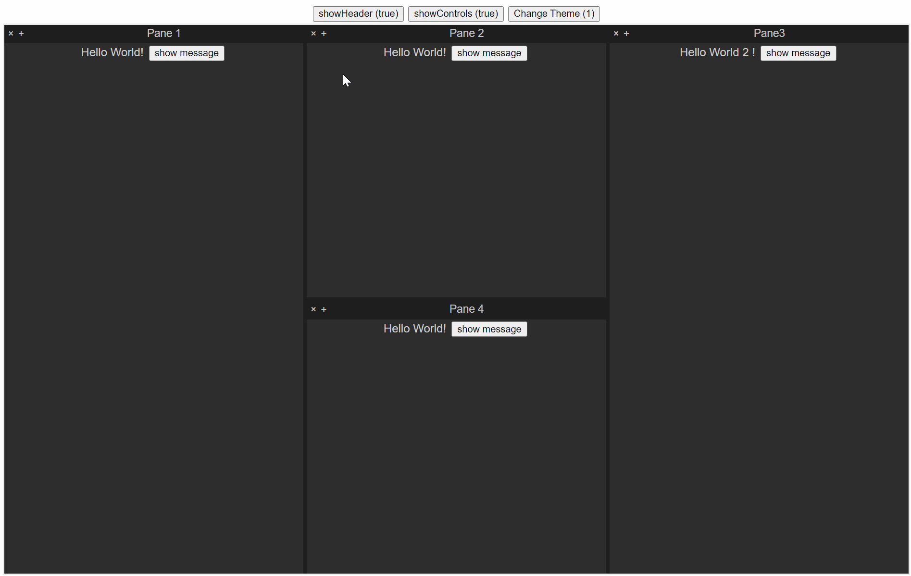

# Tangram-layout, A Vue3 split & drag layout



## Installation

```bash
    npm i tangram-layout
```

## Usage

1. Import `tangram-layout` into your project:

```ts
// import tangram-layout
import {
  TangramLayout,
  TreeNode,
  PluginObject,
  createTree,
  insertChild,
} from "tangram-layout";
import "/node_modules/tangram-layout/dist/style.css";
//import plugin views
import HelloWorld from "./components/plugins/HelloWorld/HelloWorld.vue";
import HelloWorld2 from "./components/plugins/HelloWorld2/HelloWorld2.vue";
import HelloWorld3 from "./components/plugins/HelloWorld3/HelloWorld3.vue";
```

2. Create a initial layout using a tree

```ts
// create tree for tangram layout
let layout_tree = createTree();

let node1: TreeNode = {
  ID: "1",
  name: "Pane 1", // title of the pane
  layout: "horizontal", // layout of the pane (horizontal or vertical)
  relativePosition: 1, // relative position of the pane (1: left/top, 2: right/bottom)
  twinID: undefined, // twinID of the pane (if the pane is split, it will have a twin)
  minSize: 0, //pixels
  vNode: "Hello", // name of the component to show in the pane
};
let node2: TreeNode = {
  ID: "2",
  name: "Pane 2",
  layout: "horizontal",
  relativePosition: 1,
  twinID: node1.ID,
  minSize: 0,
  vNode: "Hello",
};
let node3: TreeNode = {
  ID: "3",
  name: "Pane3",
  layout: "horizontal",
  relativePosition: 1,
  twinID: node2.ID,
  minSize: 0,
  vNode: "Hello2",
};
let node4: TreeNode = {
  ID: "4",
  name: "Pane 4",
  layout: "vertical",
  relativePosition: 1,
  twinID: node2.ID,
  minSize: 0,
  vNode: "Hello",
};
insertChild(layout_tree, node1);
insertChild(layout_tree, node2);
insertChild(layout_tree, node3);
insertChild(layout_tree, node4);
```

3. Create a plugin Configuration map.

```ts
let plugins = new Map<String, PluginObject>();
plugins.set("Hello", {
  name: "Hello",
  component: HelloWorld,
  description: "...",
  version: "xxx",
  author: "...",
});
plugins.set("Hello2", {
  name: "Hello2",
  component: HelloWorld2,
  description: "...",
  version: "xxx",
  author: "...",
});
plugins.set("Hello3", {
  name: "Hello3",
  // async import component
  component: HelloWorld3,
  description: "...",
  version: "xxx",
  author: "...",
});
```

4. Add tangram-layout element to your code

```ts
<template>
  <TangramLayout :layout="layout_tree" :pluginComponents="plugins" />
</template>
```

## Options

### Theme

`TangramLayout` has two built-in themes `light` and `dark`(default). You also can custom your theme by passing a theme to `TangramLayout`.


```ts
<script setup lang='ts'>
...
let theme = ref("");

theme.value="dark"; //built-in dark 
theme.value="light"; //built-in light
theme.value={split: { bgColor: "black" }, // custom theme
             pane: { headerBgColor: "black", bodyBgColor: "gray", color: "yellow" },
            };
</script>
<template>
  <TangramLayout :layout="layout_tree" :pluginComponents="plugins" :theme="theme"  />
</template>
```

### showHeader

You can hide the header of the pane using `showHeader`.

``` ts
<template>
  <TangramLayout :layout="layout_tree" :pluginComponents="plugins" :showHeader="false"  />
</template>
```

### showControls

You also can hide the controls of the pane using `showControls`.
``` ts
<template>
  <TangramLayout :layout="layout_tree" :pluginComponents="plugins" :showControls="false"  />
</template>
```
